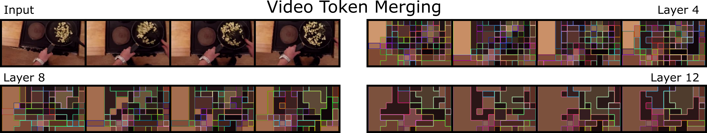
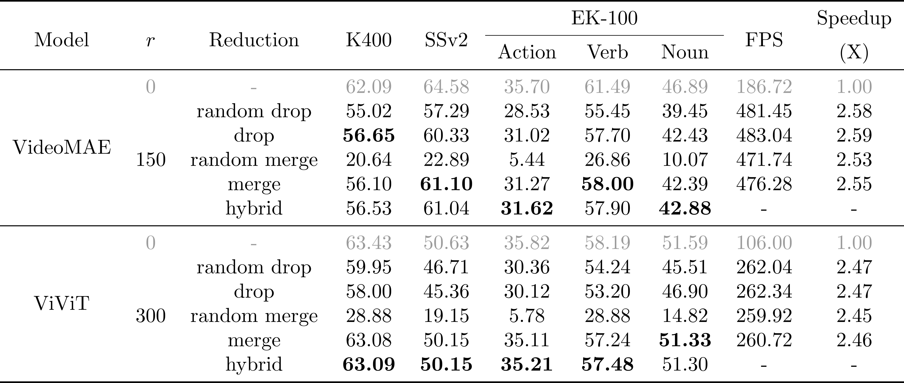

# [Video, How Do Your Tokens Merge?](https://sjpollard.github.io/video-how-do-your-tokens-merge/)



[Sam Pollard](https://sjpollard.github.io), [Michael Wray](https://mwray.github.io)

## Overview

To properly benchmark token merging in vision transformers for video, we patch it spatio-temporally into existing models and test against Kinetics-400, Something-Something v2 and EPIC-KITCHENS-100. As well as this, we qualitatively investigate the different merging decisions made by different layers and the degree to which merging relies on semantics.
We compare against other existant token reduction methods and briefly introduce a hybrid dropout/merging method that displays a slight edge over the two.

## Results



## Install

To get the SlowFast backend working, you'll need to set up the following environment:

```bash
conda create -n vhdytm
```

```bash
conda install python=3.10
```

```bash
pip install torch==2.4.1 torchvision==0.19.1 torchaudio==2.4.1 --index-url https://download.pytorch.org/whl/cu118
```

```bash
pip install simplejson
```

```bash
conda install av -c conda-forge
```

```bash
pip install opencv-python
```

```bash
cd ../
git clone https://github.com/facebookresearch/pytorchvideo.git;
cd pytorchvideo;
pip install -e .;
cd ../video-how-do-your-tokens-merge
```

```bash
pip install 'git+https://github.com/facebookresearch/fairscale'
```

```bash
pip install opencv-python
```

```bash
pip install psutil
```

```bash
pip install scipy
```

```bash
pip install pandas
```

```bash
pip install tensorboard
```

```bash
pip install pillow==9
```

```bash
pip install matplotlib
```

```bash
pip install scikit-learn
```

```bash
pip install setuptools==59.5.0
```

For further packages:

```bash
pip install einops
```

```bash
pip install timm==0.4.9
```

```bash
pip install transformers
```

```bash
pip install wandb
```

## Datasets

### Kinetics-400

* Download the videos ([here](https://opendatalab.com/OpenMMLab/Kinetics-400) is a version available online).

* The files for the training and validation splits are bundled, otherwise they should be formatted as the filename of each video followed by the ground truth class (space-separated).

* Update the `<KINETICS-400-VIDEO>` placeholder to be the path to the dataset split files.

* Update the `<KINETICS-400-PATH-PREFIX>` placeholder to be the path that precedes video filenames.

### Something-Something v2

* Download the videos from [here](https://www.qualcomm.com/developer/software/something-something-v-2-dataset/downloads).

* Download the frame lists from [here](https://dl.fbaipublicfiles.com/pyslowfast/dataset/ssv2/frame_lists/val.csv).

* Extract frames (something like [this](https://github.com/youngwanLEE/VoV3D/blob/main/vov3d/datasets/video_extractor_sthv2.py) should work).

* Update the `<SOMETHING-SOMETHING-V2-VIDEO>` placeholder to be the path to the dataset split files.

* Update the `<SOMETHING-SOMETHING-V2-PATH-PREFIX>` placeholder to be the path that precedes video filenames.

### EPIC-KITCHENS-100


* Download the frames directly with [this downloader](https://github.com/epic-kitchens/epic-kitchens-download-scripts).

* Clone the annotations from [here](https://github.com/epic-kitchens/epic-kitchens-100-annotations.git).

* Update the `<EPIC-KITCHENS-100-VIDEO>` placeholder to be the path to the videos.

* Update the `<EPIC-KITCHENS-100-ANNOTATIONS>` placeholder to be the path to the annotations repo.

* Using the official downloader should give you a folder structure like `PXX/PXX_XX/rgb_frames`, but if you somehow end up with it ordered differently you may need to change the `EPICKITCHENS.PARTICIPANT_FIRST` option or edit [this](./slowfast/datasets/frame_loader.py).

## Checkpoints

| Model | K-400 | SSv2 | EK-100 | 
| - | - | - | - | 
| TimeSformer | [Checkpoint](https://www.dropbox.com/scl/fi/zcn6byf10i4r0hhojjten/TimeSformer_divST_8x32_224_K400.pyth?rlkey=azfkkmb0qalhgt9vxofhwje54&e=1&dl=0) | [Checkpoint](https://www.dropbox.com/scl/fi/jatp4sqkr9lyt6eppe4fe/TimeSformer_divST_8_224_SSv2.pyth?rlkey=t9mjn3u67eq9bhrlniyou44xf&e=1&dl=0) | Finetuned | 
| Motionformer | [Checkpoint](https://dl.fbaipublicfiles.com/motionformer/k400_motionformer_224_16x4.pyth) | [Checkpoint](https://dl.fbaipublicfiles.com/motionformer/ssv2_motionformer_224_16x4.pyth) | [Checkpoint](https://dl.fbaipublicfiles.com/motionformer/ek_motionformer_224_16x4.pyth) | 
| VideoMAE | [Checkpoint](https://drive.google.com/file/d/18EEgdXY9347yK3Yb28O-GxFMbk41F6Ne/view) | [Checkpoint](https://drive.google.com/file/d/1xZCiaPF4w7lYmLt5o1D5tIZyDdLtJAvH/view) | Finetuned | 
| ViViT | [Checkpoint](https://huggingface.co/google/vivit-b-16x2-kinetics400/blob/main/pytorch_model.bin) | Finetuned | Finetuned |

## Examples

We have [notebooks](./notebooks) for basic demonstrations and visualisations.

## Acknowledgments

Our code is based upon the following prior works: [ToMe](https://github.com/facebookresearch/ToMe), [SlowFast](https://github.com/facebookresearch/SlowFast), [TimeSformer](https://github.com/facebookresearch/TimeSformer), [MotionFormer](https://github.com/facebookresearch/Motionformer), [VideoMAE](https://github.com/MCG-NJU/VideoMAE) and [timm](https://github.com/huggingface/pytorch-image-models).

## Citation

```
@inproceedings{pollard2025video,
    author    = {Pollard, Sam and Wray, Michael},
    title     = {Video, How Do Your Tokens Merge?},
    booktitle = {Proceedings of the IEEE/CVF Conference on Computer Vision and Pattern Recognition (CVPR) Workshops},
    month     = {June},
    year      = {2025}
}
```